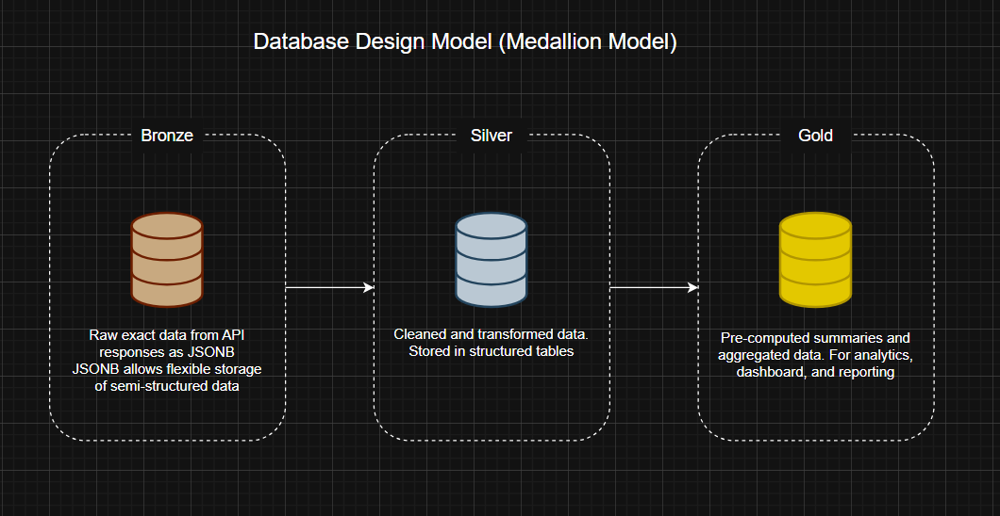

# Database Design Model

Planing the exact tables, columns, and datatypes for PostgreSQL database to ensure efficiency, consistency, and scalability.

## Database Architecture

Using **Medallion Architecture** (Bronze/Silver/Gold). A layered approach to organize data for clarity and performance.

## Bronze Layer

- Store exact raw data from API responses as JSONB.
- JSONB allow flexible storage of semi-structured data, while keeping the original source intact.

## Silver Layer

- Contain cleaned and transformed data derived from **Bronze Layer**.
- Data is stored in structured tables with defined datatypes, making queries faster and reliable.

## Gold Layer

- Holds pre-computed summaries, aggregated data derived from **Silver Layer**.
- Optimized for analytics, dashboard, and reporting, ensuring fast access to insights.

 
 

# Database Schema Design

## Raw Schema (Bronze)

**raw_data.hdb_resale**

- id (PK): _Primary key, auto-increment number makes each row unique_
- source*data (JSONB): \_Store the whole API responses as-it-is using PostgreSQL JSONB type*
- ingested*at (TIMESTAMP): \_Record the time and date when data is fetched*
- source (VARCHAR): _Store the origin API data came from_
- batch*id (VARCHAR): \_Group records that are fetched together in the same pipeline*

**raw_data.coe_results**

- Same structure as above (raw_data.hdb_resale)

**raw_data.cpi_data**

- Same structure as above (raw_data.hdb_resale)

## Cleaned Schema (Silver)

**cleaned.hdb_resale**

- id (PK): _Primary key_
- town (VACHAR): _e.g., "Toa Payoh"_
- flat*type (VACHAR): \_e.g., "4 room"*
- storey*range (VACHAR): \_e.g., "07 - 09"*
- floor*area_sqm (DECIMAL): \_e.g., 92.00*
- resale*price (DECIMAL): \_e.g., 650000.00*
- price*per_sqm (DECIMAL): \_Computed: resale_price / floor_area_sqm*
- lease*commence_year (INT): \_e.g., 1995*
- remaining*lease_year (INT): \_Computed: 99 - (current_year - lease_commence)*
- transaction*month (DATE0): \_e.g., 2024-01-01*
- processed*at (TIMESTAMP): \_Time and date this record was cleaned*
- UNIQUE constraint: _Prevent duplicate records_

\*Using **UNIQUE constraint** helps to enforce **Idempotency**. This ensure data consistency by preventing duplicate records, making pipeline safe to retry if something fails during the process, and avoid data corruption. **Outputs will always be correct and consistent no matter how many times the pipeline runs.\***

**cleaned.coe_results**

- id (PK)
- month (DATE)
- bidding*no (INT): \_1st or 2nd bidding*
- vehicle*class (VARCHAR): \_e.g., "Category A - Car up to 1600cc"*
- quota (INT): _Available COEs_
- bids*success (INT): \_Total number of successful bids*
- bids*receive (INT): \_Total number of bids recieve*
- premiumn (DECIMAL): _COE price_
- processed*at (TIMESTAMP): \_Time and date this record was cleaned*

**cleaned.cpi_data**

- id (PK)
- month (DATE)
- category (VARCHAR): _e.g., "Food", "Transport", "Housing"_
- cpi*value (DECIMAL): \_index number (e.g., 112.5)*
- mom*pct_change (DECIMAL): \_Monthly percentage difference change*
- yoy*pct_change (DECIMAL): \_Yearly percentage difference change*
- processed_at (TIMESTAMP)
- UNIQUE (month, category)

## Analytics Schema (GOLD)

**analytics.monthly_hdb_summary**

- id (PK)
- town (VARCHAR)
- flat_type (VARCHAR)
- month (DATE)
- avg_price (DECIMAL)
- median_price (DECIMAL)
- min_price (DECIMAL)
- max_price (DECIMAL)
- transaction_count (INT)
- avg_price_per_sqm (DECIMAL)
- mom*pct_change (DECIMAL): \_Monthly percentage difference change*
- yoy*pct_change (DECIMAL): \_Yearly percentage difference change*
- computed_at (TIMESTAMP)

**analytics.monthly_coe_summary**

- id (PK)
- month (DATE)
- vehicle_class (VARCHAR)
- avg_premium (DECIMAL)
- mom_pct_change (DECIMAL)
- computed_at (TIMESTAMP)

**analytics.monthly_cpi_summary**

- id (PK)
- month (DATE)
- category (VARCHAR)
- cpi_value (DECIMAL)
- mom_change_pct (DECIMAL)
- yoy_change_pct (DECIMAL)
- computed_at (TIMESTAMP)
- UNIQUE(month, category)

**analytics.dashboard_kpis**

- id (PK)
- kpi*name (VARCHAR): \_e.g., "avg_hdb_price"*
- kpi*value (DECIMAL): \_e.g., 650000.00*
- kpi*pct_change (DECIMAL): \_e.g., +2.5 (compare to last period)*
- period (DATE): _This kpi belongs to which month_
- computed_at (TIMESTAMP)

_Advantages of **Pre-Compute**: If 100+ user request: "What is the average HDB price in Tampines for 2024?" at the same, the system would run 100+ queries against the database of 500k+ rows each. This could result in overload the database and cause a crash. With analytics pre-compute schema, those 100+ queries will be reading from just **one pre-computed row each**. This reduces the load, improves performance, and ensure stability even under heavy user demand._

\***_Dashboard KPIs Table_**: Frontend dashboard display KPI cards. Instead of computing the metrics on the fly each time user request, the pipeline already pre-compute them once daily. This means the API only need to run a simple query: **SELECT \* FROM analytics.dashibaord_kpis**. This result is an instant response, with no computation required, and also ensure fast performance and reduce load on the database.\*
